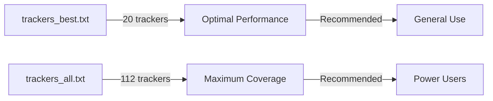

The **trackers_all.txt** list contains all 112 verified working public BitTorrent trackers. This comprehensive list provides maximum peer discovery at the cost of higher overhead.

## Overview

<Info>
  **112 trackers** - Updated daily - All protocols included
</Info>

This is the complete collection of all public trackers that:
- Are currently online and responding
- Have passed automated health checks
- Are not duplicates (same IP/domain)
- Are not on the blacklist

## Download URLs

<CodeGroup>
```bash GitHub Raw
curl -O https://raw.githubusercontent.com/ngosang/trackerslist/master/trackers_all.txt
```

```bash GitHub Pages Mirror
curl -O https://ngosang.github.io/trackerslist/trackers_all.txt
```

```bash jsDelivr CDN
curl -O https://cdn.jsdelivr.net/gh/ngosang/trackerslist@master/trackers_all.txt
```
</CodeGroup>

### Direct Download Links

<CardGroup cols={3}>
  <Card title="GitHub Raw" icon="github" href="https://raw.githubusercontent.com/ngosang/trackerslist/master/trackers_all.txt">
    Primary source
  </Card>
  <Card title="Mirror" icon="clone" href="https://ngosang.github.io/trackerslist/trackers_all.txt">
    GitHub Pages
  </Card>
  <Card title="CDN" icon="bolt" href="https://cdn.jsdelivr.net/gh/ngosang/trackerslist@master/trackers_all.txt">
    jsDelivr (fastest)
  </Card>
</CardGroup>

## Example Trackers

Sample of trackers from the complete list:

<AccordionGroup>
  <Accordion title="UDP Trackers (51 total)" icon="signal">
    ```text
    udp://tracker.opentrackr.org:1337/announce
    udp://open.demonii.com:1337/announce
    udp://open.stealth.si:80/announce
    udp://exodus.desync.com:6969/announce
    udp://tracker1.myporn.club:9337/announce
    udp://tracker.torrent.eu.org:451/announce
    udp://tracker.theoks.net:6969/announce
    udp://tracker.srv00.com:6969/announce
    udp://tracker.filemail.com:6969/announce
    udp://tracker.dler.org:6969/announce
    ... and 41 more
    ```
  </Accordion>
  
  <Accordion title="HTTPS Trackers (14 total)" icon="lock">
    ```text
    https://torrent.tracker.durukanbal.com:443/announce
    https://tracker.zhuqiy.com:443/announce
    https://tracker.pmman.tech:443/announce
    https://tracker.moeking.me:443/announce
    https://tracker.moeblog.cn:443/announce
    https://tracker.iperson.xyz:443/announce
    https://tracker.gcrenwp.top:443/announce
    https://tracker.bt4g.com:443/announce
    ... and 6 more
    ```
  </Accordion>
  
  <Accordion title="HTTP Trackers (47 total)" icon="globe">
    ```text
    http://tracker.opentrackr.org:1337/announce
    http://www.genesis-sp.org:2710/announce
    http://tracker810.xyz:11450/announce
    http://tracker2.dler.org:80/announce
    http://tracker.zhuqiy.com:80/announce
    http://tracker.xiaoduola.xyz:6969/announce
    ... and 41 more
    ```
  </Accordion>
  
  <Accordion title="WebSocket Trackers (2 total)" icon="wifi">
    ```text
    wss://tracker.files.fm:7073/announce
    ws://tracker.files.fm:7072/announce
    ```
    
    <Note>
      WebSocket trackers are only supported by WebTorrent-compatible clients like [WebTorrent Desktop](https://webtorrent.io/desktop/) and browser-based clients.
    </Note>
  </Accordion>
</AccordionGroup>

<Warning>
  These are examples only. The actual list changes daily as trackers come online and offline. Always download the latest version.
</Warning>

## Protocol Breakdown

<CardGroup cols={2}>
  <Card title="UDP" icon="signal">
    **51 trackers** (45.5%)
    
    Fastest protocol with minimal overhead. Best for general use.
  </Card>
  <Card title="HTTP" icon="globe">
    **47 trackers** (42.0%)
    
    Universal compatibility. Works through most proxies.
  </Card>
  <Card title="HTTPS" icon="lock">
    **14 trackers** (12.5%)
    
    Encrypted and secure. Best for restrictive networks.
  </Card>
  <Card title="WebSocket" icon="wifi">
    **2 trackers** (1.8%)
    
    For WebTorrent clients only. Browser-compatible.
  </Card>
</CardGroup>

## When to Use This List

<Check>
  **Recommended for:**
  - Maximum peer discovery
  - Rare or unpopular torrents
  - Seeding many files
  - Power users with high-performance systems
  - Situations where best_trackers.txt isn't finding enough peers
</Check>

<Warning>
  **Not recommended for:**
  - Low-powered devices (Raspberry Pi, NAS)
  - Mobile devices
  - Users with limited bandwidth
  - Clients that struggle with many trackers
  - Networks with strict firewall rules
</Warning>

## Performance Considerations

### System Impact

| Aspect | Impact Level | Notes |
|--------|-------------|-------|
| CPU Usage | Low-Medium | Tracker communication is lightweight |
| Memory Usage | Low | ~1-2 MB for tracker state |
| Network Overhead | Medium | 112 tracker announce requests |
| Client Startup | Slower | Must connect to all trackers |
| Bandwidth | ~50 KB/s | For tracker announces only |

<Info>
  Most modern torrent clients handle 112 trackers efficiently. However, older devices or embedded systems may experience slowdowns.
</Info>

### Comparison with Best Trackers



## File Format

The list uses a simple newline-separated format:

```text
udp://tracker.opentrackr.org:1337/announce

http://tracker.opentrackr.org:1337/announce

udp://open.demonii.com:1337/announce

udp://open.stealth.si:80/announce

https://torrent.tracker.durukanbal.com:443/announce

...
```

<Info>
  Each tracker URL is followed by a blank line. This format ensures compatibility with all major BitTorrent clients.
</Info>

## Integration Examples

<Tabs>
  <Tab title="qBittorrent">
    ```bash
    # Download trackers
    curl -s https://raw.githubusercontent.com/ngosang/trackerslist/master/trackers_all.txt \
      -o /tmp/trackers_all.txt
    
    # qBittorrent will read from this file on startup
    # Add to Tools → Options → BitTorrent → "Automatically add these trackers"
    cat /tmp/trackers_all.txt
    ```
    
    <Warning>
      qBittorrent may show warnings with this many trackers. This is normal and doesn't affect functionality.
    </Warning>
  </Tab>
  
  <Tab title="Transmission">
    ```bash
    #!/bin/bash
    # Add all trackers to Transmission torrents
    
    # Download and format trackers
    trackers=$(curl -s https://raw.githubusercontent.com/ngosang/trackerslist/master/trackers_all.txt | \
      grep -v '^$' | tr '\n' ',')
    
    # Add to each torrent
    transmission-remote -l | tail -n +2 | head -n -1 | \
      awk '{print $1}' | while read id; do
        transmission-remote -t $id --tracker-add "$trackers"
      done
    
    echo "Added $(echo $trackers | tr ',' '\n' | wc -l) trackers to all torrents"
    ```
  </Tab>
  
  <Tab title="Deluge">
    ```python
    # deluge_add_trackers.py
    from deluge_client import DelugeRPCClient
    import requests
    
    # Connect to Deluge
    client = DelugeRPCClient('127.0.0.1', 58846, 'admin', 'password')
    client.connect()
    
    # Download trackers
    url = 'https://raw.githubusercontent.com/ngosang/trackerslist/master/trackers_all.txt'
    response = requests.get(url)
    trackers = [t.strip() for t in response.text.split('\n') if t.strip()]
    
    # Add to all torrents
    for torrent_id in client.core.get_torrents_status({}, []):
        for tracker in trackers:
            client.core.add_tracker_to_torrent(torrent_id, tracker)
    
    print(f"Added {len(trackers)} trackers to all torrents")
    ```
  </Tab>
  
  <Tab title="rTorrent">
    ```bash
    # Download trackers
    curl -s https://raw.githubusercontent.com/ngosang/trackerslist/master/trackers_all.txt | \
      grep -v '^$' > /tmp/trackers_all.txt
    
    # Add to .rtorrent.rc
    echo 'method.insert = d.add_trackers, simple, "d.tracker.insert=0,\"$argument.0=\""' \
      >> ~/.rtorrent.rc
    
    # Add trackers from file
    while IFS= read -r tracker; do
      echo "schedule2 = add_tracker_$RANDOM, 0, 0, \"d.multicall2=,d.add_trackers=$tracker\"" \
        >> ~/.rtorrent.rc
    done < /tmp/trackers_all.txt
    ```
  </Tab>
</Tabs>

## Protocol-Specific Alternatives

If 112 trackers is too many, or you need specific protocols:

<CardGroup cols={2}>
  <Card title="UDP Only" icon="signal" href="/lists/protocol-specific#udp-trackers">
    **51 trackers** - Fastest protocol
    
    `trackers_all_udp.txt`
  </Card>
  <Card title="HTTP Only" icon="globe" href="/lists/protocol-specific#http-trackers">
    **47 trackers** - Universal compatibility
    
    `trackers_all_http.txt`
  </Card>
  <Card title="HTTPS Only" icon="lock" href="/lists/protocol-specific#https-trackers">
    **14 trackers** - Encrypted connections
    
    `trackers_all_https.txt`
  </Card>
  <Card title="WebSocket" icon="wifi" href="/lists/protocol-specific#websocket-trackers">
    **2 trackers** - Browser-compatible
    
    `trackers_all_ws.txt`
  </Card>
</CardGroup>

## IP Address Version

For DNS-blocked environments:

<Card title="trackers_all_ip.txt" icon="router" href="/lists/ip-addresses">
  **61 trackers** with IP addresses instead of domain names
  
  [View IP Address Lists →](/lists/ip-addresses)
</Card>

<Note>
  The IP version has fewer trackers (61 vs 112) because Cloudflare-protected trackers cannot be converted to IP addresses.
</Note>

## Quality Assurance

### Automated Checks

Every tracker in this list passes:

<Steps>
  <Step title="Connectivity Test">
    Tracker responds to announce requests within timeout
  </Step>
  <Step title="Health Check">
    Tracker returns valid peer information
  </Step>
  <Step title="Duplicate Detection">
    No other tracker with same domain/IP is included
  </Step>
  <Step title="Blacklist Screening">
    Tracker is not flagged for malware, registration-only, or malfunction
  </Step>
</Steps>

### Exclusion Criteria

Trackers are excluded if they:
- Require registration or account
- Are detected as malware by antivirus
- Return fake peer counts
- Consistently fail health checks
- Point to same IP as included tracker
- Redirect to HTTPS from HTTP (duplicate)

## Troubleshooting

<AccordionGroup>
  <Accordion title="Client running slowly with this list" icon="gauge">
    **Solution:** Use `trackers_best.txt` instead. 112 trackers may be too many for your client or device.
    
    Most torrent clients work best with 20-50 trackers. The full list is primarily for:
    - Rare torrents with few seeds
    - Professional seedbox operations
    - High-performance dedicated servers
  </Accordion>
  
  <Accordion title="Many trackers showing errors" icon="triangle-exclamation">
    **This is normal.** With 112 trackers:
    - Some will be temporarily offline
    - Some may not support your torrent
    - Network/firewall may block certain protocols
    - Geographic distance causes timeouts
    
    As long as 10-20 trackers work, you're fine. The redundancy is intentional.
  </Accordion>
  
  <Accordion title="Want even more trackers?" icon="plus">
    112 trackers is the complete list of all working public trackers.
    
    **Additional options:**
    - Enable **DHT** (Distributed Hash Table) in your client
    - Enable **PEX** (Peer Exchange)
    - Enable **LSD** (Local Service Discovery)
    - Join private trackers for specific content types
    
    These supplement trackers with decentralized peer discovery.
  </Accordion>
  
  <Accordion title="How often should I update?" icon="clock">
    **Recommendation:** Update weekly to monthly.
    
    The list changes daily, but changes are usually minor:
    - 1-3 trackers added/removed per day
    - Order changes based on performance
    
    Updating too frequently can cause unnecessary overhead. Weekly updates provide fresh trackers without excessive churn.
  </Accordion>
</AccordionGroup>

## Next Steps

<CardGroup cols={2}>
  <Card title="Best Trackers" icon="star" href="/lists/best-trackers">
    Smaller curated list for better performance
  </Card>
  <Card title="Protocol-Specific" icon="network-wired" href="/lists/protocol-specific">
    Lists filtered by protocol type
  </Card>
  <Card title="Integration Guide" icon="code" href="/guides/torrent-clients">
    Detailed client setup instructions
  </Card>
  <Card title="API Access" icon="terminal" href="/api/endpoints">
    Programmatic access to tracker data
  </Card>
</CardGroup>