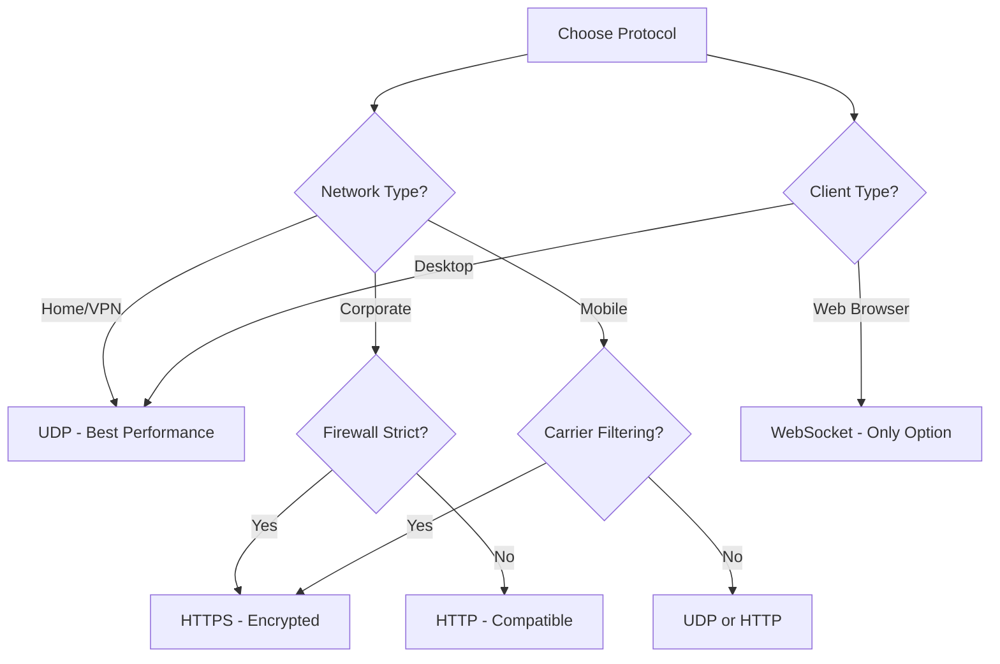

Protocol-specific tracker lists allow you to use only trackers that match your network requirements, firewall rules, or client capabilities.

## Available Protocol Lists

<CardGroup cols={2}>
  <Card title="UDP Trackers" icon="signal">
    **51 trackers** - Fastest protocol, lowest overhead
  </Card>
  <Card title="HTTP Trackers" icon="globe">
    **47 trackers** - Universal compatibility
  </Card>
  <Card title="HTTPS Trackers" icon="lock">
    **14 trackers** - Encrypted and secure
  </Card>
  <Card title="WebSocket" icon="wifi">
    **2 trackers** - Browser-compatible (WebTorrent)
  </Card>
</CardGroup>

---

## UDP Trackers

<Info>
  **51 trackers** - `trackers_all_udp.txt`
</Info>

UDP (User Datagram Protocol) trackers are the fastest and most efficient option for BitTorrent. They have minimal overhead and provide quick peer discovery.

### Download URLs

<CodeGroup>
```bash GitHub Raw
curl -O https://raw.githubusercontent.com/ngosang/trackerslist/master/trackers_all_udp.txt
```

```bash GitHub Pages Mirror
curl -O https://ngosang.github.io/trackerslist/trackers_all_udp.txt
```

```bash jsDelivr CDN
curl -O https://cdn.jsdelivr.net/gh/ngosang/trackerslist@master/trackers_all_udp.txt
```
</CodeGroup>

### Direct Links

<CardGroup cols={3}>
  <Card title="GitHub" icon="github" href="https://raw.githubusercontent.com/ngosang/trackerslist/master/trackers_all_udp.txt">
    Primary source
  </Card>
  <Card title="Mirror" icon="clone" href="https://ngosang.github.io/trackerslist/trackers_all_udp.txt">
    GitHub Pages
  </Card>
  <Card title="CDN" icon="bolt" href="https://cdn.jsdelivr.net/gh/ngosang/trackerslist@master/trackers_all_udp.txt">
    jsDelivr CDN
  </Card>
</CardGroup>

### Example Trackers

```text
udp://tracker.opentrackr.org:1337/announce
udp://open.demonii.com:1337/announce
udp://open.stealth.si:80/announce
udp://exodus.desync.com:6969/announce
udp://tracker1.myporn.club:9337/announce
udp://tracker.torrent.eu.org:451/announce
udp://tracker.theoks.net:6969/announce
udp://tracker.srv00.com:6969/announce
udp://tracker.filemail.com:6969/announce
udp://tracker.dler.org:6969/announce
... and 41 more
```

### When to Use UDP

<Check>
  **Ideal for:**
  - General torrenting (best performance)
  - Home networks and personal use
  - VPN connections
  - High-speed connections
  - Low-latency requirements
</Check>

<Warning>
  **May not work on:**
  - Corporate networks (UDP often blocked)
  - Some mobile networks
  - Restrictive firewalls
  - Public WiFi with protocol filtering
</Warning>

### Advantages

- Lowest latency (no connection overhead)
- Minimal bandwidth usage for announces
- Faster peer discovery
- Better for high-volume seeding
- Stateless protocol (no connection tracking)

### Port Information

Common UDP tracker ports:
- `6969` - Most common tracker port
- `1337` - Popular alternative port
- `80` - HTTP port (bypasses some filters)
- `451` - Alternative port
- `9337` - High port range

<Tip>
  Ensure your firewall allows outbound UDP connections to these ports for optimal tracker communication.
</Tip>

---

## HTTP Trackers

<Info>
  **47 trackers** - `trackers_all_http.txt`
</Info>

HTTP trackers use standard web protocol, offering universal compatibility and reliable connections through most networks and proxies.

### Download URLs

<CodeGroup>
```bash GitHub Raw
curl -O https://raw.githubusercontent.com/ngosang/trackerslist/master/trackers_all_http.txt
```

```bash GitHub Pages Mirror
curl -O https://ngosang.github.io/trackerslist/trackers_all_http.txt
```

```bash jsDelivr CDN
curl -O https://cdn.jsdelivr.net/gh/ngosang/trackerslist@master/trackers_all_http.txt
```
</CodeGroup>

### Direct Links

<CardGroup cols={3}>
  <Card title="GitHub" icon="github" href="https://raw.githubusercontent.com/ngosang/trackerslist/master/trackers_all_http.txt">
    Primary source
  </Card>
  <Card title="Mirror" icon="clone" href="https://ngosang.github.io/trackerslist/trackers_all_http.txt">
    GitHub Pages
  </Card>
  <Card title="CDN" icon="bolt" href="https://cdn.jsdelivr.net/gh/ngosang/trackerslist@master/trackers_all_http.txt">
    jsDelivr CDN
  </Card>
</CardGroup>

### Example Trackers

```text
http://tracker.opentrackr.org:1337/announce
http://www.genesis-sp.org:2710/announce
http://tracker810.xyz:11450/announce
http://tracker2.dler.org:80/announce
http://tracker.zhuqiy.com:80/announce
http://tracker.xiaoduola.xyz:6969/announce
http://tracker.vanitycore.co:6969/announce
http://tracker.sbsub.com:2710/announce
http://tracker.renfei.net:8080/announce
http://tracker.mywaifu.best:6969/announce
... and 37 more
```

### When to Use HTTP

<Check>
  **Ideal for:**
  - Networks that block UDP
  - Behind HTTP proxies
  - Corporate or school networks
  - Legacy systems
  - Maximum compatibility needs
</Check>

### Advantages

- Works through HTTP proxies
- Passes most firewalls
- Easier to debug (standard HTTP protocol)
- Connection-oriented (more reliable)
- Can use authentication if needed

### Disadvantages

- Higher latency than UDP
- More bandwidth overhead (HTTP headers)
- Connection establishment overhead
- May require keep-alive connections

---

## HTTPS Trackers

<Info>
  **14 trackers** - `trackers_all_https.txt`
</Info>

HTTPS trackers provide encrypted communication with trackers, preventing ISPs and network administrators from seeing tracker traffic.

### Download URLs

<CodeGroup>
```bash GitHub Raw
curl -O https://raw.githubusercontent.com/ngosang/trackerslist/master/trackers_all_https.txt
```

```bash GitHub Pages Mirror
curl -O https://ngosang.github.io/trackerslist/trackers_all_https.txt
```

```bash jsDelivr CDN
curl -O https://cdn.jsdelivr.net/gh/ngosang/trackerslist@master/trackers_all_https.txt
```
</CodeGroup>

### Direct Links

<CardGroup cols={3}>
  <Card title="GitHub" icon="github" href="https://raw.githubusercontent.com/ngosang/trackerslist/master/trackers_all_https.txt">
    Primary source
  </Card>
  <Card title="Mirror" icon="clone" href="https://ngosang.github.io/trackerslist/trackers_all_https.txt">
    GitHub Pages
  </Card>
  <Card title="CDN" icon="bolt" href="https://cdn.jsdelivr.net/gh/ngosang/trackerslist@master/trackers_all_https.txt">
    jsDelivr CDN
  </Card>
</CardGroup>

### Example Trackers

```text
https://torrent.tracker.durukanbal.com:443/announce
https://tracker.zhuqiy.com:443/announce
https://tracker.pmman.tech:443/announce
https://tracker.moeking.me:443/announce
https://tracker.moeblog.cn:443/announce
https://tracker.iperson.xyz:443/announce
https://tracker.gcrenwp.top:443/announce
https://tracker.bt4g.com:443/announce
https://tr.zukizuki.org:443/announce
https://tracker.iochimari.moe:443/announce
... and 4 more
```

### When to Use HTTPS

<Check>
  **Ideal for:**
  - Privacy-conscious users
  - ISPs that throttle BitTorrent
  - Deep packet inspection networks
  - Countries with internet censorship
  - Corporate networks that block P2P
  - Combining with VPN for maximum privacy
</Check>

<Warning>
  **Limitations:**
  - Only 14 trackers available (fewer options)
  - Higher overhead than HTTP or UDP
  - Some clients may have issues with HTTPS trackers
  - Certificate validation can cause problems
</Warning>

### Advantages

- Encrypted tracker communication
- Hides tracker URLs from ISP
- Looks like regular HTTPS traffic
- Harder to block than plain BitTorrent
- Certificate-based authentication

### Privacy Considerations

<Note>
  HTTPS trackers only encrypt tracker communication. The actual torrent data transfer is still unencrypted unless you use a VPN or other encryption method.
</Note>

What HTTPS trackers hide:
- Which tracker you're contacting
- What torrent you're downloading
- Your peer ID and client info (from network observers)

What HTTPS trackers don't hide:
- Your IP address (visible to tracker)
- Peer-to-peer connections (still unencrypted)
- DHT traffic

---

## WebSocket Trackers

<Info>
  **2 trackers** - `trackers_all_ws.txt`
</Info>

WebSocket trackers enable BitTorrent in web browsers through WebTorrent. These are only supported by WebTorrent-compatible clients.

### Download URLs

<CodeGroup>
```bash GitHub Raw
curl -O https://raw.githubusercontent.com/ngosang/trackerslist/master/trackers_all_ws.txt
```

```bash GitHub Pages Mirror
curl -O https://ngosang.github.io/trackerslist/trackers_all_ws.txt
```

```bash jsDelivr CDN
curl -O https://cdn.jsdelivr.net/gh/ngosang/trackerslist@master/trackers_all_ws.txt
```
</CodeGroup>

### Direct Links

<CardGroup cols={3}>
  <Card title="GitHub" icon="github" href="https://raw.githubusercontent.com/ngosang/trackerslist/master/trackers_all_ws.txt">
    Primary source
  </Card>
  <Card title="Mirror" icon="clone" href="https://ngosang.github.io/trackerslist/trackers_all_ws.txt">
    GitHub Pages
  </Card>
  <Card title="CDN" icon="bolt" href="https://cdn.jsdelivr.net/gh/ngosang/trackerslist@master/trackers_all_ws.txt">
    jsDelivr CDN
  </Card>
</CardGroup>

### Available Trackers

```text
wss://tracker.files.fm:7073/announce
ws://tracker.files.fm:7072/announce
```

<Warning>
  Only 2 WebSocket trackers are publicly available. This is not sufficient for most use cases - combine with other tracker types.
</Warning>

### When to Use WebSocket

<Check>
  **Required for:**
  - Web-based BitTorrent clients
  - WebTorrent Desktop
  - Browser extensions
  - Instant.io and similar services
  - Cross-platform web apps
</Check>

### Compatible Clients

- [WebTorrent Desktop](https://webtorrent.io/desktop/) - Desktop client with WebSocket support
- [Instant.io](https://instant.io/) - Browser-based torrent streaming
- [BitTorrent Web](https://www.bittorrent.com/products/web/) - Official web client
- Any web app using [webtorrent](https://github.com/webtorrent/webtorrent) library

<Note>
  Traditional BitTorrent clients (qBittorrent, Transmission, Deluge, etc.) do **not** support WebSocket trackers. These are exclusively for WebTorrent-compatible clients.
</Note>

### Protocol Details

- `ws://` - Unencrypted WebSocket (port 7072)
- `wss://` - Encrypted WebSocket over TLS (port 7073)

### Limitations

- Very few public WebSocket trackers exist
- Only WebTorrent clients can connect
- Not compatible with traditional BitTorrent clients
- Limited to web browser capabilities
- Higher overhead than UDP/HTTP

---

## Protocol Comparison

### Performance Comparison

| Protocol | Speed | Overhead | Compatibility | Firewall | Privacy |
|----------|-------|----------|---------------|----------|----------|
| UDP | Fastest | Minimal | Medium | Often blocked | Low |
| HTTP | Medium | Medium | Excellent | Rarely blocked | Low |
| HTTPS | Medium | High | Good | Rarely blocked | High |
| WebSocket | Medium | High | Limited | Rarely blocked | Medium |

### Use Case Decision Matrix



### Recommendation by Scenario

<Tabs>
  <Tab title="Home User">
    **Recommended:** UDP
    
    ```bash
    curl -O https://raw.githubusercontent.com/ngosang/trackerslist/master/trackers_all_udp.txt
    ```
    
    Best performance and lowest overhead for unrestricted networks.
  </Tab>
  
  <Tab title="Corporate Network">
    **Recommended:** HTTPS
    
    ```bash
    curl -O https://raw.githubusercontent.com/ngosang/trackerslist/master/trackers_all_https.txt
    ```
    
    Encrypted traffic passes DPI and looks like regular HTTPS.
  </Tab>
  
  <Tab title="Public WiFi">
    **Recommended:** HTTP or HTTPS
    
    ```bash
    curl -O https://raw.githubusercontent.com/ngosang/trackerslist/master/trackers_all_http.txt
    ```
    
    TCP-based protocols more reliable on congested networks.
  </Tab>
  
  <Tab title="Web Application">
    **Required:** WebSocket
    
    ```bash
    curl -O https://raw.githubusercontent.com/ngosang/trackerslist/master/trackers_all_ws.txt
    ```
    
    Only option for browser-based BitTorrent clients.
  </Tab>
</Tabs>

## Combining Multiple Protocols

<Tip>
  You can use trackers from multiple protocols simultaneously. Most users benefit from combining UDP and HTTP trackers for maximum compatibility and performance.
</Tip>

### Optimal Combination

```bash
# Download UDP and HTTP trackers
curl -s https://raw.githubusercontent.com/ngosang/trackerslist/master/trackers_all_udp.txt > trackers_combined.txt
curl -s https://raw.githubusercontent.com/ngosang/trackerslist/master/trackers_all_http.txt >> trackers_combined.txt

# Result: 51 UDP + 47 HTTP = 98 trackers
```

This provides:
- Fast UDP connections when available
- HTTP fallback when UDP is blocked
- Near-complete coverage without WebSocket clutter

## Next Steps

<CardGroup cols={2}>
  <Card title="Best Trackers" icon="star" href="/lists/best-trackers">
    Top 20 trackers across all protocols
  </Card>
  <Card title="IP Addresses" icon="router" href="/lists/ip-addresses">
    Protocol lists with IP addresses for DNS issues
  </Card>
  <Card title="Integration Guide" icon="code" href="/guides/torrent-clients">
    Add trackers to your torrent client
  </Card>
  <Card title="API Reference" icon="terminal" href="/api/endpoints">
    Programmatic access to tracker lists
  </Card>
</CardGroup>